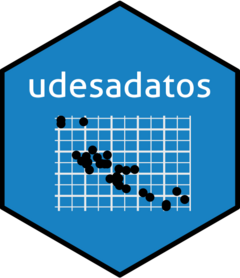

# udesadatos 


<!-- badges: start -->
<!-- badges: end -->

The goal of udesadatos is to Academic Rmarkdowns Templates for UDESA.

## Installation

You can install the development version of udesadatos like so:

``` r
devtools::install_github("rafzamb/udesadatos")
```


